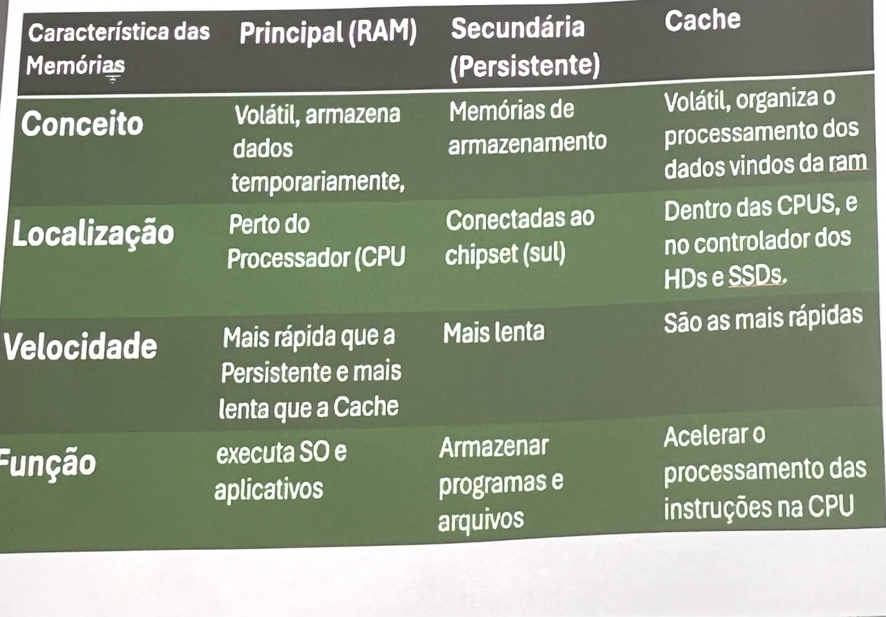

# Aula dia 10/04

## Memória Flash

### Flash NOR:

- Acessa dados de maneira aleatória e com alta velocidade. Usada desde 1988, ano em que inaugurou, até hoje, mesmo com um alto custo e tempo de gravação nas células.

### Flash NAND:

- Projetada para armazenamento de dados em dispositivos como SSDs, pendrives e cartões de memória. Tem maior densidade de armazenamento e custo mais baixo por bit. É mais propensa a erros, mas utiliza algoritmos de correção para garantir a integridade dos dados.

## Memórias Cache

- É um tipo de memória ultra rápida que armazena os dados e instruções mais utilizadas pelo processador, permitindo que sejam acessados rapidamente. Começaram a ser utilizados a partir dos micros 386, quando os processadores passaram a ser mais rápidos que a memória RAM.
- Quando um dado é acessado na memória, um bloco inteiro (64 bits) contendo o dado é trazido à memória cache. Blocos vizinhos também podem ser acessados para uso futuro(prefetching). Na próxima vez o dado ou um dado vizinho é usado, já está na cache (que é mais rápido).

