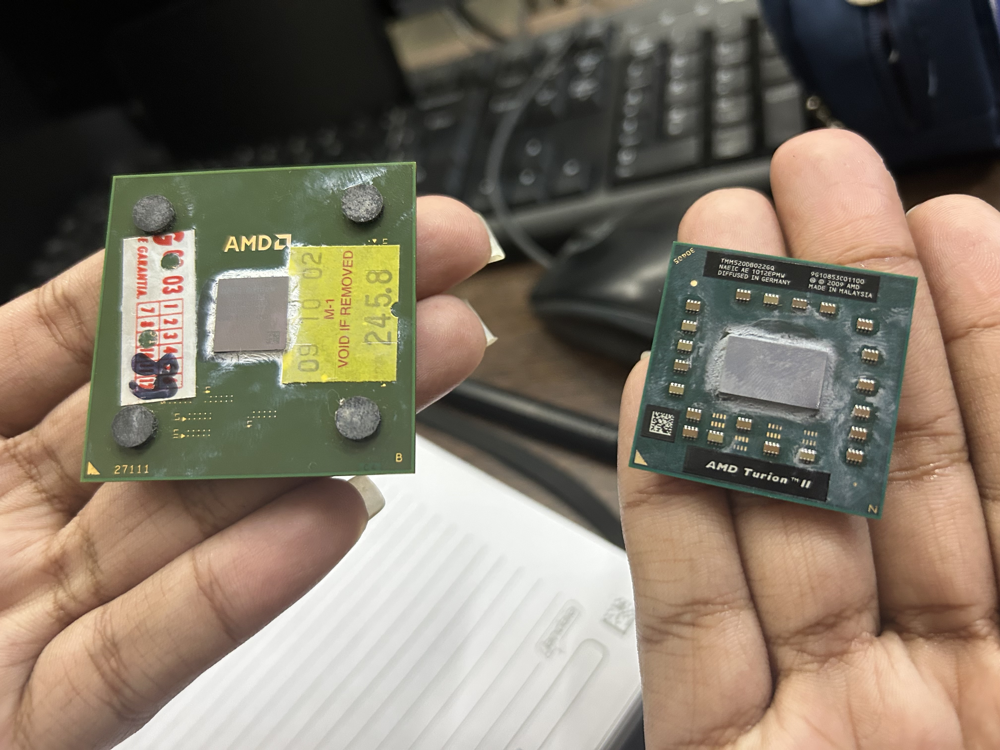
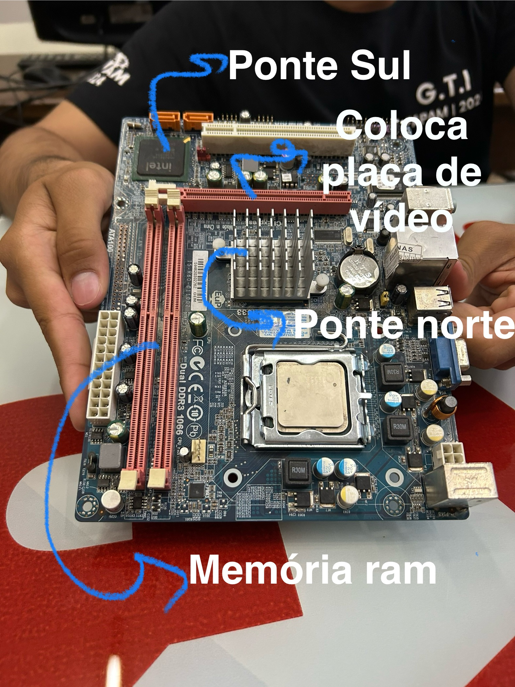

# PROCESSADORES

- A CPU é o cérebro do computador.
- Executa programas armazenados na memória principal buscando suas instruções, examinando-as e então executando uma após a outra.

### Principais Evoluções

1. Velocidade (h, mHz, gHz)
2. Componentes (miniaturização, técnicas de fabricação)
- Exemplo de miniaturização:

 3. Coprocessador

1. Barramento múltiplo: multi tarefa preemptive
2. Inclusão de controladores na CPU
3. Múltiplos núcleos (cores) virtuais e físicos

### Componentes da Placa-Mãe:

