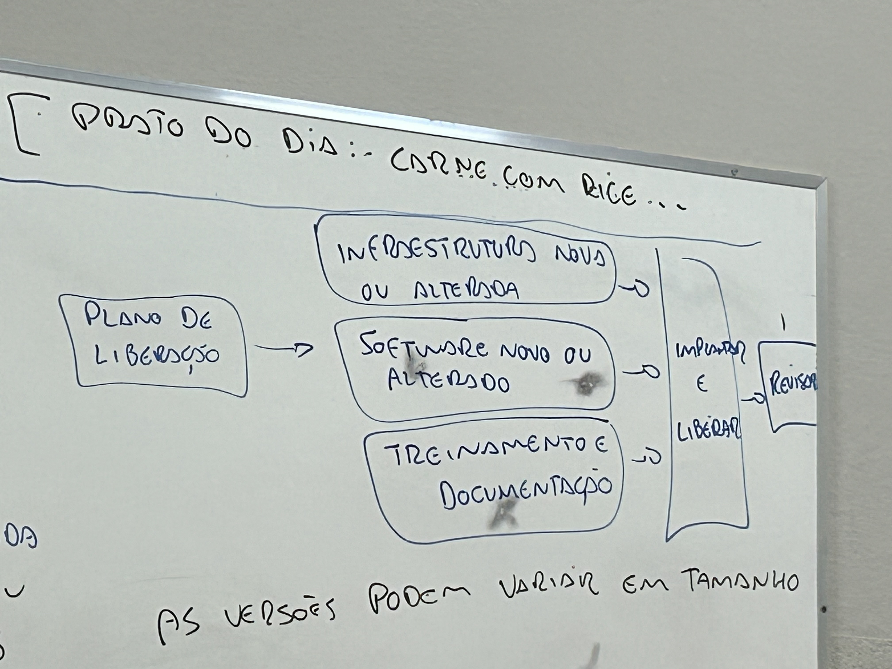

# Práticas em ITIL - Parte 2

## Gerenciamento de Ativos

- O objetivo da prática de gerenciamento de ativos de ti: planejar e gerenciar todos os ativos de T.I.
1. Maximizar valor
2. Reduzir custos
3. Gerenciar riscos

Definição de ativo de T.I. segundo a ITIL: qualquer componente financeiramente valioso que pode contribuir para a entrega de um produto ou serviço de T.I..

- Inclui: Softwares, Hardwares, Redes, Cloud.
- Inclui tecnologia operacional (OT) - Ligados a IOT (Internet of Things)

Vantagens: contribui para a visibilidade  dos ativos e a compreensão do seu valor.

- Requer informações de inventário precisas.

<aside>
💡

Ajuda a responder perguntas, como: como calcular o número de PC’s sobressalentes que uma organização requer. Quais/Quantos ativos de T.I. a organização possui? (auxilia no processo de auditoria)

</aside>

Para isso é necessário:

- Identificá-los, rotulá-los (ID), atribuir responsabilidades aos que detém.
- Controlar/Gerir seu ciclo de vida.

## Gerenciamento de Catálogo de Serviços

- O conjunto de atividades relacionadas à publicação, edição, manutenção de descrições de produtos e serviços e suas ofertas relacionadas.
- Fornece uma visão de quais os serviços estão disponíveis e quais termos.
- A lista completa de um catálogo de serviços pode não ser aplicável a todos os clientes/usuários. Da mesma forma, os vários atributos de serviços, como especificações técnicas, ofertas, acordos, custos..

<aside>
💡

Catálogo de serviço deve ser capaz de fornecer diferentes visões e níveis de detalhes para diferentes partes interessadas.

</aside>

Visão do usuário: Ofertas de serviços e detalhes de provisionamento.

Visão do cliente: Dados de nível de serviço, financeiro e desempenho.

Visão do T.I.: Informações técnicas (configuração), segurança, configurações.

- Catálogo: ativos, inativos, obsoletos

## Gerenciamento de Incidentes

- Minimizar o impacto negativo dos incidentes, restaurando a operação normal do serviço o mais rápido o possível.

<aside>
💡

Incidente = interrupção não planejada de um serviço ou redução na qualidade de um serviço.

</aside>

- Os tempos de resolução devem ser acordados, documentados e comunicados.
- Incidentes com baixo impacto devem ser gerenciados para que não consumam muitos recursos.
- Incidentes com maior impacto podem consumir mais recursos.
- Alguns incidentes podem ser resolvidos pelo próprio usuário. Exemplo: Resetar serviço/route, trocar senha, gerar novo boleto.
- Alguns serviços serão atendidos pela central de atendimento.
- Incidentes  + complexos deverão ser atendidos pela equipe de suporte.
    - Incidentes podem ser escalados para fornecedores ou parceiros.

## Gerenciamento de Liberação

OBJETIVO: disponibilizar para uso serviços e recursos novos e alterados.

DEFINIÇÃO: uma versão de um serviço ou outro item de configuração, que é disponibilizada para uso.

- Ex: uma versão pode incluir muitos componentes de infraestrutura e aplicativos diferentes que funcionam juntos para fornecer funcionalidade nova ou alterada. Pode incluir:  documentação, treinamento, processos ou ferramentas atualizadas e quaisquer outros componentes necessários.

- As versões podem variar em tamanho, desde muito pequeno, envolvendo apenas um pequeno recurso alterado, até o muito grande, envolvendo muitos componentes que oferecem um serviço completamente novo.

## Gerenciamento de Problemas

- Reduzir a probabilidade e o impacto dos incidentes, identificando as causas reais e potenciais dos incidentes, e gerenciando soluções alternativas e erros conhecidos.

DEFINIÇÕES → PROBLEMA → ERRO CONHECIDO

PROBLEMA = Uma causa potencial de 1 ou mais incidentes.

ERRO CONHECIDO = Problema conhecido que foi analisado, mas não foi resolvido.

IDENTIFICAÇÃO DO PROBLEMA → CONTROLE DO PROBLEMA → CONTROLE DE ERROS

## Gerenciamento de Continuidade

- Garantir que a disponibilidade e o desempenho de um serviço sejam mantidos em níveis suficientes no caso de um desastre.
- É acionado quando uma interrupção do serviço ou risco organizacional ocorre em uma escala que é maior que a capacidade da organização de lidar com a resposta normal e práticas de recuperação, como incidentes e gerenciamento de incidentes graves.

RTO = Objetivo de Tempo de Recuperação → tempo máximo aceitável após a interrupção de um serviço.

RPO = Objetivo de Ponto de Recuperação → ponto até o qual as informações devem ser restauradas.

BIA = Análise de impacto de negócio → funções vitais do negócio e suas dependências.

## Gerenciamento de Configuração

- Objetivo → Garantir que informações precisas e confiáveis sobre a configuração de serviços e os IC’s (Item de Configuração) que o suportam estejam disponíveis quando e onde forem necessárias.

IC = Qualquer componente que precise ser gerenciado para entregar um serviço de T.I.

- Coleta e gerencia