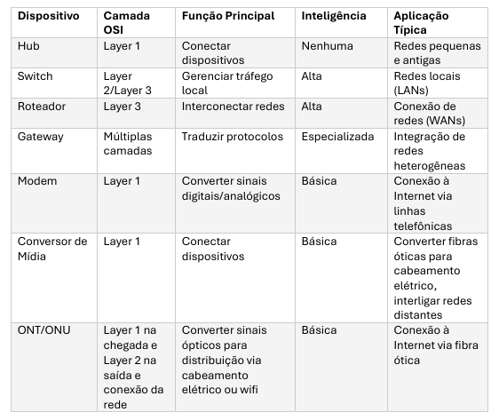

# ATIVOS DE REDE

## INTRODUÇÃO

- Para que uma rede funcione de maneira eficiente,
diversos dispositivos, conhecidos como ativos de rede, são utilizados. Entre eles, destacam-se os hubs, switches, roteadores e gateways. Cada um desses dispositivos possui características e funcionalidades específicas, atuando em diferentes camadas do modelo OSI (Open Systems Interconnection).

## HUBS

- São dispositivos de redes básicos que operam na cama física (layer 1) do modelo OSI. Conectam múltiplos dispositivos em uma rede LAN (local).  São considerados dispositivos "burros", pois não possuem capacidade de processamento para gerenciar o tráfego de dados.

### CARACTERÍSTICAS

- FUNCIONAMENTO: Quando um pacote de dados chega a uma porta do hub, ele é replicado e enviado para todas as outras portas, independentemente do destinatário. Isso é conhecido como domínio de colisão, onde todos os dispositivos compartilham o mesmo meio de comunicação.
- DESEMPENHO: Os hubs são propensos a colisões de dados, especialmente em redes com alto volume de tráfego. Isso limita sua eficiência e escalabilidade.
- APLICAÇÕES: Eram comuns em redes pequenas e antigas, mas hoje são considerados obsoletos, tendo sido substituídos por switches.

### LIMITAÇÕES

- Não filtram ou direcionam pacotes.
- Não suportam comunicação full-duplex (transmissão e recepção simultânea).
- Ineficientes em redes com muitos dispositivos.

## SWITCHES

- Operam na camada de enlace (Layer 2) do modelo OSI, embora existam switches que também operam na camada de rede (Layer 3), conhecidos como switches multicamadas. Eles são amplamente utilizados em redes locais (LANs) para conectar dispositivos e gerenciar o tráfego de dados de forma inteligente.

### CARACTERÍSTICAS

- FUNCIONAMENTO: São capazes de identificar o endereço MAC dos dispositivos conectados. Mantém uma tabela desses endereços chamada MAC Adress Table, ela mapeia cada dispositivo à sua porta, o que reduz colisões e melhora o desempenho.
- DESEMPENHO: Suportam comunicação full-duplex, o que permite que dispositivos transmitam e recebam dados simultaneamente.
    
    FUNCIONALIDADES AVANÇADAS:
    
    - VLANs: permite a segmentação lógica da rede em grupos isolados, melhorando a segurança.
    - Spanning Tree Protocol(STP): Evita loops na rede.
    - Switches Layer 3: Realizam roteamento básico entre VLANs, funcionando como roteadores simplificados.
- APLICAÇÕES: conexão de computadores, impressoras e outros dispositivos em redes locais e gerenciamento de tráfego em redes corporativas e data centers.

## ROTEADORES

- Essenciais para interconexão de redes diferentes, como uma rede LAN e a internet. Operam na camada de rede (Layer 3) do modelo OSI, utilizando endereços IP.

### CARACTERÍSTICAS

- FUNCIONAMENTO: utilizam tabelas de roteamento para determinar o melhor caminho para os pacotes de dados chegarem ao seu destino. Podem usar protocolos de roteamento dinâmico ou roteamento estático.
- DESEMPENHO: Lidam com grandes volumes de tráfego entre redes, alta capacidade de processamento e largura de banda.
    
    FUNCIONALIDADES AVANÇADAS
    
    - NAT(Network Address Translation): permite que vários dispositivos em uma rede local compartilhem o mesmo endereço IP público para acessar a internet.
    - Firewall: Oferece segurança ao filtrar tráfego indesejado e bloquear ataques.
    - QoS(Quality of Service): Prioriza o tráfego de dados críticos.

## GATEWAYS

- São dispositivos ou softwares que atuam como intermediários entre redes que utilizam protocolos diferentes. Eles são capazes de traduzir e converter dados para que redes incompatíveis possam se comunicar. Gateways operam em várias camadas do modelo OSI, dependendo da complexidade da conversão necessária.

### CARACTERÍSTICAS

- FUNCIONAMENTO:  Converte protocolos de comunicação, formatos de dados ou até mesmo endereçamentos.
- DESEMPENHO: Dispositivos especializados que exigem alto
poder de processamento para realizar conversões complexas em tempo real.
    
    Funcionalidades Avançadas:
    • Tradução de Protocolos: Converte dados entre redes que utilizam protocolos diferentes.
    • Integração de Sistemas: Permite a comunicação entre sistemas heterogêneos, como redes industriais e redes corporativas.
    • Segurança: Pode incluir funcionalidades de firewall e criptografia para proteger a comunicação entre redes.
    
- Aplicações: Conexão de redes industriais (como redes SCADA) a redes corporativas.
• Integração de sistemas legados com redes modernas.
• Comunicação entre redes que utilizam tecnologias diferentes (por exemplo, IPv4 e IPv6).

## MODEMS

- Dispositivos que convertem sinais digitais em analógicos e vice-versa, permitindo a transmissão de dados através de
linhas telefônicas ou outros meios de comunicação analógicos. Eles operam na camada física (Layer 1) do modelo OSI e são essenciais para a conexão à internet em tecnologias como DSL, cabo e dial-up.

### CARACTERÍSTICAS

- FUNCIONAMENTO: Modulam os sinais digitais do computador
em sinais analógicos que podem ser transmitidos através de linhas telefônicas. No destino, o modem demodula os sinais analógicos de volta para o formato digital.
- DESEMPENHO: A velocidade de transmissão de dados de um modem depende da tecnologia utilizada.
    
    Funcionalidades Avançadas:
    • Conexão à Internet: Modems são usados para conectar redes locais à internet através de provedores de serviços.
    • Suporte a Múltiplas Tecnologias: Modems podem suportar diferentes tecnologias, como ADSL, VDSL e cabo.
    • Integração com Roteadores: Muitos modems modernos são combinados com roteadores, oferecendo funcionalidades de rede local e acesso à internet em um único dispositivo.
    
- Aplicações:
• Conexão à internet em residências e pequenos escritórios.
• Transmissão de dados através de linhas telefônicas em áreas remotas.
• Integração com roteadores para fornecer acesso à internet e
gerenciamento de rede local.

## CONVERGÊNCIA ENTRE DISPOSITIVOS

- Estes aparelhos contam com as funções de switch, modem e roteador. Nestes casos, o principal beneficiado é o consumidor, que pode usar um aparelho sem ter que se preocupar muito com os detalhes de suas funções, pois normalmente eles são bem integrados. Entretanto, mesmo estes produtos exigem do usuário algum conhecimento prévio dos conceitos de redes abordados aqui, para serem bem utilizados.

